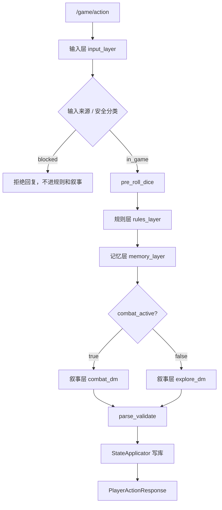
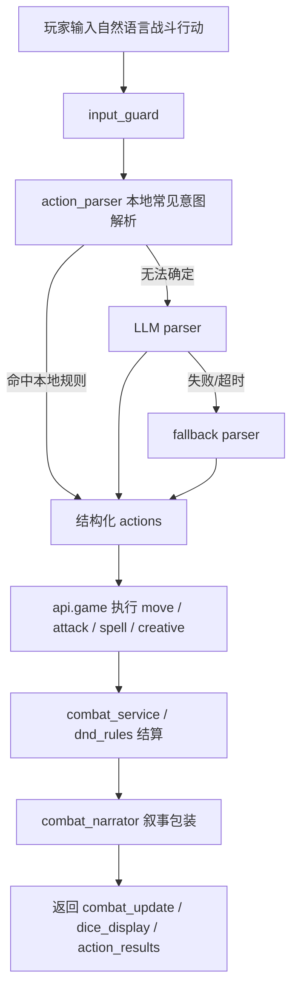

# 技术架构文档

**项目：** AI 跑团平台（DnD 5e）
**文档更新时间：** 2026-05-07
**当前状态：** Adventure / Combat / DM Agent 已进入结构化拆分阶段。

## 1. 总览

```text
React 19 + Vite 8
  │
  │ HTTP / WebSocket
  ▼
FastAPI + SQLAlchemy 2.0
  ├─ 本地 5e 规则层：dnd_rules / combat_service / api.combat
  ├─ DM 编排层：LangGraph dm_agent
  ├─ 输入安全层：input_guard
  ├─ 自然语言战斗解析：action_parser
  ├─ RAG：ChromaDB
  └─ DB：SQLite（本地）/ PostgreSQL（生产）
```

核心原则：

- **AI 负责叙事和意图理解，不负责规则数学。**
- **后端是规则权威。** 前端可以展示骰子和交互，但最终 HP、条件、回合资源由后端写库。
- **DM Agent 拆成输入 / 规则 / 叙事 / 记忆四层。** 这样后续改 prompt 或规则校验时不必碰整条链路。
- **多人和单人共用主业务入口。** `/game/action` 根据 `session.combat_active` 和多人发言权分流。

## 2. 技术栈

| 层 | 当前选型 |
|----|----------|
| 前端 | React 19、React Router 7、Vite 8、Zustand 5 |
| 前端测试 | Vitest 4、Testing Library、jsdom |
| 后端 | FastAPI、Pydantic v2、SQLAlchemy 2.0 async |
| 数据库 | SQLite（本地默认）、PostgreSQL（生产推荐） |
| AI 编排 | LangGraph StateGraph |
| LLM 接入 | `langchain-openai`，支持 DeepSeek / OpenAI / AiHubMix / OpenRouter 等 OpenAI 兼容 API |
| RAG | ChromaDB 本地持久化 |
| 通信 | HTTP + FastAPI WebSocket |
| 部署 | nginx 静态前端 + uvicorn 后端，或 Docker Compose |

## 3. 后端架构

### 3.1 API 层

```text
backend/api/
├── auth.py                 注册 / 登录
├── modules.py              模组上传、解析、列表
├── characters.py           角色创建、队友生成、准备法术
├── game.py                 会话、探索行动、自然语言战斗入口、休息、日志、checkpoint
├── rooms.py                多人房间
├── ws.py                   WebSocket
├── deps.py                 共享依赖和序列化
└── combat/                 战斗端点包
```

`api/combat/` 已从历史大文件拆为多个职责模块：

```text
_shared.py                  回合状态、距离、移动、广播等共享 helper
info.py                     战斗状态和技能栏查询
turns.py                    结束回合、回合推进
movement.py                 地图移动
attack_rolls.py             攻击检定 pending attack
attack_damage.py            伤害确认
attack_targeting.py         目标和距离辅助
attack_modifiers.py         优劣势 / 暴击 / 修正
attack_actions.py           攻击动作组合
attacks.py                  旧 /action 攻击兼容路径
spell_rolls.py              法术掷骰 pending spell
spell_effects.py            法术效果应用
spell_targets.py            法术目标校验
spell_catalog.py            法术目录辅助
spellcasting.py             旧施法入口兼容
pending_spells.py           pending spell 状态
ai_turn*.py                 AI 回合上下文、动作、攻击、施法、结束
class_features.py           职业特性
grapples.py                 擒抱 / 推撞
maneuvers.py                战技
smites.py                   神圣斩击
reactions.py                反应
conditions.py               条件
deathsaves.py               濒死豁免
schemas.py                  combat 请求/响应模型
```

### 3.2 服务层

```text
backend/services/
├── campaign_delta.py           Living Campaign State 归一化与合并
├── graphs/
│   ├── module_parser.py        模组解析 graph
│   ├── party_generator.py      AI 队友生成 graph
│   ├── dm_agent.py             DM Agent 公开入口和 LangGraph 连线
│   ├── dm_agent_nodes.py       input/rules/memory/combat/explore/parse 节点
│   ├── dm_agent_state.py       LangGraph state 类型和消息窗口
│   ├── dm_agent_prompts.py     探索/战斗/战役状态提示词
│   ├── dm_agent_utils.py       兼容出口：输入/规则/记忆/输出 helper
│   ├── dm_agent_input_meta.py  输入元数据
│   ├── dm_agent_rules_context.py     规则层上下文
│   ├── dm_agent_memory_context.py    记忆层上下文
│   ├── dm_agent_output_normalizer.py DM 输出归一化与 schema repair
│   ├── dm_agent_runtime.py     骰池、初始状态、最终响应包装
│   ├── dm_agent_messages.py    LLM 用户消息组装
│   ├── dm_agent_memory.py      LangGraph checkpoint 初始化
│   └── dm_campaign_state.py    战役状态摘要生成
├── input_guard.py              输入分类和拦截入口
├── input_guard_policy.py       本地高置信度拦截/放行规则
├── input_guard_types.py        输入守卫类型定义
├── action_parser.py            自然语言战斗行动解析
├── combat_service.py           攻击/伤害/治疗/条件核心规则
├── dnd_rules.py                5e 属性、检定、先攻、骰子等规则
├── combat_narrator.py          战斗机械结果 → 叙事
├── ai_combat_agent.py          敌人/队友 AI 战斗决策
├── context_builder.py          构建 DM 输入上下文
├── state_applicator.py         DM 输出 state_delta 写库
├── langgraph_client.py         AI graph 统一客户端
├── llm.py                      LLM 工厂
├── local_rag_service.py        ChromaDB 检索
└── character_roster.py         session 队伍访问器
```

## 4. DM Agent 四层流程

可视化架构版本见 [DM_Agent_Architecture.html](./DM_Agent_Architecture.html)，其中单独展开了输入来源、规则拦截、叙事分支、记忆来源、自然语言战斗解析和输出契约。



### 输入层

输入来源：

- `human_input`
- `ai_generated_choice`
- `system_action`
- `ai_takeover`

AI 生成选项不是客户端说了算。后端会检查 `session.game_state.last_turn.player_choices`，只有点击文本匹配上一轮 DM 生成选项时才承认为 `ai_generated_choice`。

### 规则层

规则层负责：

- 识别技能检定、战斗触发、规则作弊。
- 放行合理术语，例如优势骰、激励骰、帮助动作。
- 阻断明显超出 5e 规则或游戏边界的内容。

### 叙事层

叙事层负责把规则允许的行动写成 DM 文本，但不能绕过后端规则。战斗伤害、HP、条件、回合资源仍由规则层和 API combat 模块决定。

### 记忆层

记忆来自：

- `GameLog`
- `session.session_history`
- `session.campaign_state`
- LangGraph checkpoint
- RAG 检索出的模组片段

### Living Campaign State

探索 DM 可以在标准响应中输出 `campaign_delta`，用于表达本轮产生的结构化战役变化：

- `quest_updates`：任务状态变化，按任务名去重更新 `campaign_state.quest_log`。
- `npc_updates`：NPC 关系、关键事实、承诺，按 NPC 名合并进 `campaign_state.npc_registry`。
- `key_decisions_add`：影响后续剧情的关键决定，去重追加到 `campaign_state.key_decisions`。
- `world_flags_set`：世界状态 flag，合并到 `campaign_state.world_flags`。
- `clues_add`：玩家实际发现的新线索，去重追加到 `campaign_state.clues`，并补 `found_at` / `is_new`。
- `scene_vibe`：当前地点、时间和紧张度，写入 `session.game_state.scene_vibe`。

`services.campaign_delta.normalize_campaign_delta` 会先修复坏类型和缺字段，`StateApplicator` 再调用 `apply_campaign_delta` 合并入 session。旧版 `state_delta.clues_add` 和 `state_delta.scene_vibe` 仍被兼容读取。

前端 Adventure 底部 HUD 会读取最近任务、线索、NPC 关系和关键决定，让玩家能感到 DM 正在记住故事。

## 5. 自然语言战斗流程



关键修复：

- 近战目标不可达时，只生成 `move`，不生成同回合假 `attack`。
- 叙事器根据实际执行动作类型选择 `move` / `attack` / `creative` / `out_of_range`，避免“只是移动却讲成攻击失败”。

## 6. 前端架构

### 6.1 页面

```text
frontend/src/pages/
├── Home.jsx
├── Login.jsx
├── CharacterCreate.jsx
├── Adventure.jsx
├── Combat.jsx
├── CharacterSheet.jsx
├── RoomLobby.jsx
├── Room.jsx
└── ClassGallery.jsx
```

### 6.2 Adventure 拆分

```text
components/adventure/
├── AdventureTopBar.jsx
├── AdventureStage.jsx
├── DialoguePanel.jsx
├── DialogueChoices.jsx
├── DialogueFreeSpeak.jsx
├── DialogueLogList.jsx
├── DialoguePendingCheck.jsx
├── DialogueResponseBox.jsx
├── AdventureBottomHud.jsx
├── AdventurePartyHud.jsx
├── AdventureQuestHud.jsx
└── MultiplayerSpeakBar.jsx

hooks/
├── useAdventureSession.js
├── useAdventureActions.js
├── useAdventureMultiplayer.js
├── useDialogueFlow.js
├── useDialogueWsSync.js
└── useSkillCheck.js
```

### 6.3 Combat 拆分

```text
components/combat/
├── CombatStage.jsx
├── IsoBattlefield.jsx
├── IsoBattlefieldCell.jsx
├── IsoUnit.jsx
├── CombatHud.jsx
├── CombatHudSkillBar.jsx
├── CombatHudCombatLog.jsx
├── CombatHudControls.jsx
├── InitiativeRibbon.jsx
├── SpellModal*.jsx
├── ReactionPrompt.jsx
├── SmitePrompt.jsx
└── TurnBanner.jsx

hooks/
├── useCombatLoader.js
├── useCombatDerivedState.js
├── useCombatPlayerActions.js
├── useCombatAttackFlow.js
├── useCombatSpellFlow.js
├── useCombatAiTurns.js
├── useCombatTurnControls.js
├── useCombatSkillBar.js
├── useCombatPrediction.js
└── useCombatRoom.js
```

## 7. 数据模型概览

主要 ORM：

- `User`
- `Module`
- `Character`
- `Session`
- `CombatState`
- `GameLog`
- `SessionMember`

重要 JSON 字段：

- `Session.game_state`
- `Session.campaign_state`
- `CombatState.entity_positions`
- `CombatState.turn_order`
- `CombatState.turn_states`
- `Character.derived`
- `Character.spell_slots`
- `Character.conditions`
- `Module.parsed_content`
- `GameLog.dice_result`

修改 JSON 字段必须遵守 [docs/json-field-convention.md](/Users/qft/Desktop/ai-dnd-5e/docs/json-field-convention.md)，必要时调用 `flag_modified`。

## 8. API 概览

| 模块 | 路径 |
|------|------|
| 认证 | `/auth/register`, `/auth/login`, `/auth/me` |
| 模组 | `/modules/`, `/modules/upload`, `/modules/{id}` |
| 角色 | `/characters/options`, `/characters/create`, `/characters/generate-party`, `/characters/{id}` |
| 游戏 | `/game/sessions`, `/game/action`, `/game/skill-check`, `/game/sessions/{id}/rest` |
| 战斗 | `/game/combat/{session_id}`, `/attack-roll`, `/damage-roll`, `/spell-roll`, `/spell-confirm`, `/move`, `/end-turn`, `/ai-turn` |
| 多人 | `/game/rooms/create`, `/join`, `/start`, `/claim-character`, `/fill-ai` |
| WebSocket | `/ws/sessions/{session_id}?token=...` |

## 9. 测试

后端测试：

```bash
cd backend
python -m pytest tests/ -q
```

前端测试：

```bash
cd frontend
npm test
npm run build
```

当前重点测试覆盖：

- `backend/tests/unit/test_action_parser.py`
- `backend/tests/unit/test_input_guard.py`
- `backend/tests/unit/test_dm_agent_layers.py`
- `backend/tests/integration/test_combat_endpoints.py`
- `backend/tests/smoke/test_imports.py`
- `frontend/src/pages/__tests__/Adventure.smoke.test.jsx`
- `frontend/src/pages/__tests__/Combat.smoke.test.jsx`
- `frontend/src/hooks/__tests__/useCombat*.test.js`

## 10. 已知技术债

- `npm run lint` 会扫到 `frontend/public/design-preview-*` 旧设计稿和部分 React Compiler 风格规则报错；当前发布以 `npm test` 和 `npm run build` 为准。
- 前端 chunk 较大，Dice / world 资源后续适合动态 import。
- DM Agent prompt 和规则层还可以继续拆成更小的 prompt 模板和 policy 文件。
- 部分 5e 子职业/反应/召唤物等高级规则仍为近似实现。
- 多人 WebSocket 仍是进程内管理，横向扩容需要 Redis pub/sub 或外部消息层。
